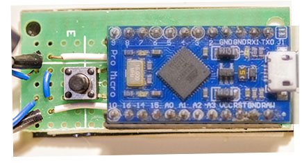

#Bill of materials
* MCU : Sparkfun Pro Micro 5V (or Deek Robot Pro Micro)
* IR LED & Phototransistor : TCRT-5000
* R1 : 100 Ohm
* R2 : 4700 Ohm
* S1 : tactile momentary switch

* 2 x 50 cm phone cable with one pair
* 2 x 0.1" male header 12 connectors
* 0.1" perfboard cut at 7x18    

#Schema

#Implentation

(grey wires are solder joints on the other side)

Without MCU board:

With MCU board mounted:

TCRT-5000 should be break into a IR Led and a IR Phototransitor. Don't forget to mark the Emitter and the Cathode before breaking the plastic case: all pins are the same size.

The IR Led is the blue component, the phototransistor is the black one.

 

For each components, solder each pins at one end of the phone cable. Correctly isolate the soldered pins.

  
